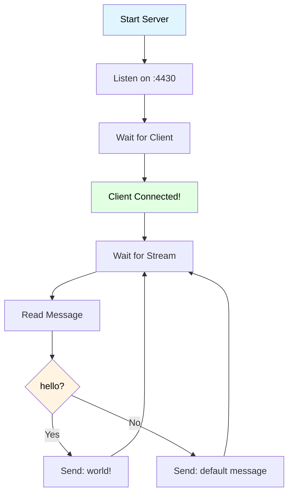
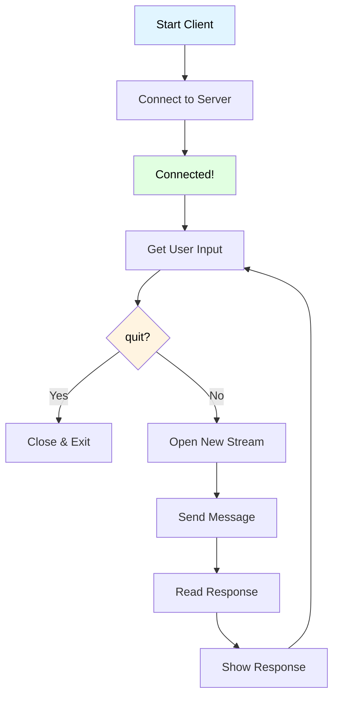

# Hello World Example

- A simple WebTransport example demonstrating bidirectional communication between client and server.
- if the client sends "hello", the server responds with "world!".

> [!NOTE]
> - Each message uses a **new stream**
> - Self-signed certificates used

## What This Example Shows

- Creating a WebTransport server
- Connecting a WebTransport client
- Opening bidirectional streams
- Sending and receiving messages

## How It Works

1. **Server** listens for WebTransport connections
2. **Client** connects and opens streams for each message
3. Server responds with "world!" for "hello", otherwise sends a default message


## Running the Example

### Terminal 1 - Start the Server
```bash
go run examples/helloWorld/server/main.go
```

### Terminal 2 - Start the Client
```bash
go run examples/helloWorld/client/main.go
```

### Try It Out
```
Enter message: hello
Server response: world!

Enter message: test
Server response: I only respond to 'hello' with 'world!'

Enter message: quit
```


### Server Side



**Key Functions:**
- `webtransport.Server{}` → Create server
- `server.Upgrade()` → Accept client connection
- `session.AcceptStream()` → Wait for incoming stream
- `stream.Write()` → Send response


### Client Side



**Key Functions:**
- `webtransport.Dialer{}` → Create client
- `dialer.Dial()` → Connect to server
- `session.OpenStreamSync()` → Open new stream
- `stream.Write()` / `io.ReadAll()` → Send/receive data
- `session.CloseWithError()` → Graceful disconnect
